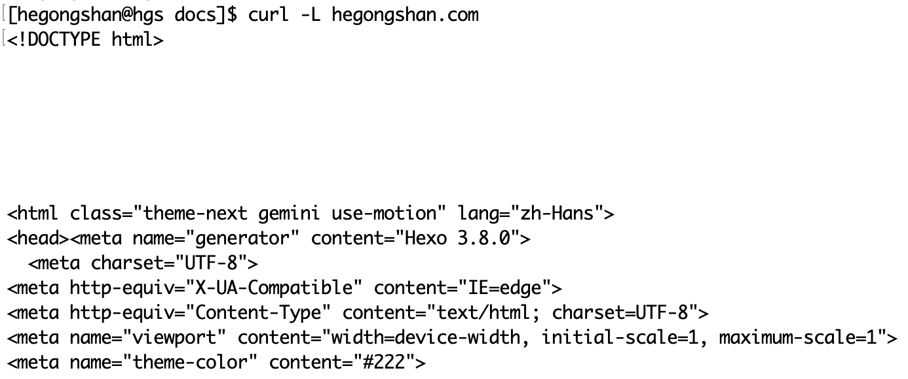
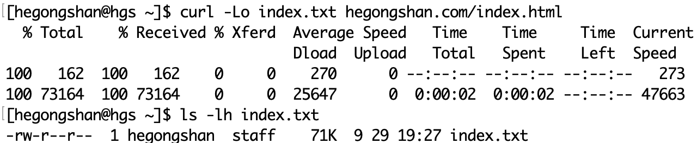

curl，全称为client URL，官网为https://curl.se。

```shell
curl www.hegongshan.com
```

### 设置User-Agent

`-A, --user-agent <name>`，指定HTTP请求头中的用户代理字段：User-Agent。

```shell
curl -A 'Mozilla/5.0 (Macintosh; Intel Mac OS X 10_14_6) AppleWebKit/537.36 (KHTML, like Gecko) Chrome/96.0.4664.110 Safari/537.36' www.baidu.com
```

### 设置请求头

```shell
-H, --header <header>
```


```shell
curl -H 'User-Agent: php/1.0' 
```

### 发送HTTP请求

设置HTTP请求方式

```shell
-X, --request <command>
```

发送POST请求数据

```shell
-d, --data <data>
```

### 重定向

-L, --location

```shell
curl -L www.hegongshan.com
```

首先，我们来看下页面被移动到新地址的情况：


对于这种情况，只需要加上`-L`选项，就可以让curl对新地址再次发出请求：



### 输出到文件

默认情况下，curl会将响应的内容输出到终端中，如果要输出到文件中：

* `-O,--remote-name`：截取url最后的部分作为文件名

> curl -O https://example.com/filename

对于上述命令，下载的文件名为`filename`

示例：


* `-o, --output <file>`：指定文件名



### 不显示进度条和错误信息

* `-s, --silent`：不显示进度信息和错误信息
* `-S, --show-error`：当指定了`-s`选项时，如果发生错误，让curl显示错误信息

当二者一起使用时，可以实现不显示进度信息。

示例：当断网时，执行curl命令


